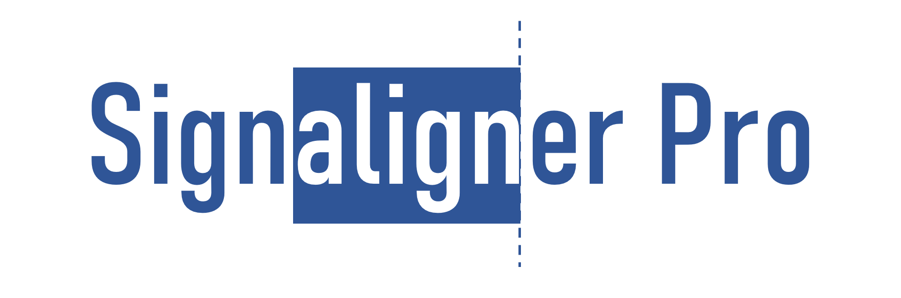
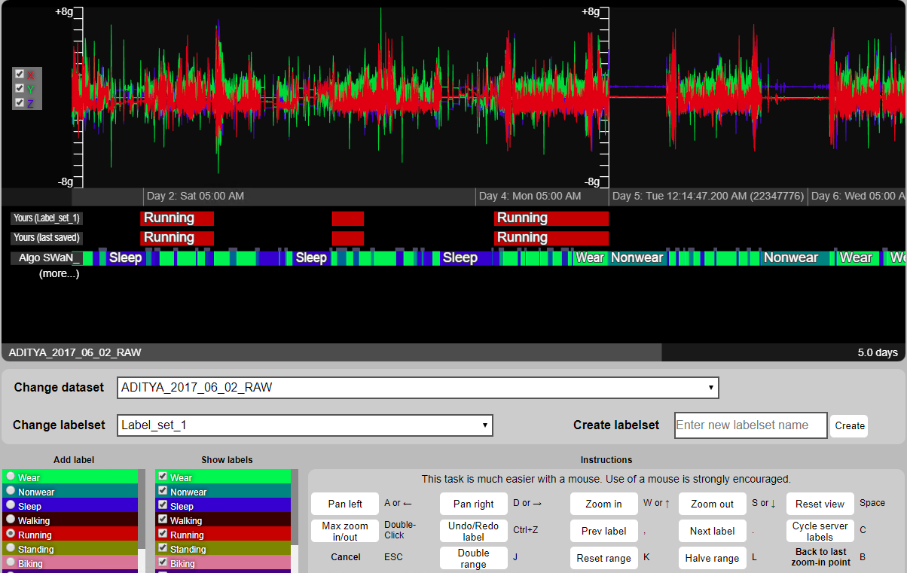

# Signaligner Pro #

## What is Signaligner Pro ##

Signaligner-Pro is an interactive tool for algorithm-assisted exploration and annotation of raw accelerometer data. The tool can be used by researchers using raw accelerometer data to support research in activity recognition/machine learning, exercise science, and sleep quality research among others.

## Download Signaligner Pro ##

### v2.3.9-beta ###
Note that macOS and Linux updates will be released soon for v2.3.7-beta

* [Windows-v2.3.9-beta](https://github.com/crowdgames/signaligner-web/releases/download/v2.3.9-beta/signalignerpro-windows-v2.3.9-beta-4c9207f4-20210517.zip)
* [macOS-v2.3.9-beta](https://github.com/crowdgames/signaligner-web/releases/download/v2.3.9-beta/signalignerpro-macos-v2.3.9-beta-4c9207f4-20210517.zip)
* [Linux-v2.3.9-beta](https://github.com/crowdgames/signaligner-web/releases/download/v2.3.9-beta/signalignerpro-linux-v2.3.9-beta-4c9207f4-20210517.zip)
* [Source-v2.3.9-beta](https://github.com/crowdgames/signaligner-web/releases/download/v2.3.9-beta/signalignerpro-source-v2.3.9-beta-4c9207f4-20210517.zip)

## Research paper and citation request

If you have used Signaligner Pro as part of your research and want to get more details, please read and cite the following paper.

* Aditya Ponnada, Seth Cooper, Qu Tang, Binod Thapa-Chhetry, Josh Aaron Miller, Dinesh John, and Stephen Intille. (2021). Signaligner Pro: A Tool to Explore and Annotate Multi-day Raw Accelerometer Data. In 2021 IEEE International Conference on Pervasive Computing and Communications Workshops (PerCom Workshops). DOI:https://doi.org/10.1109/PerComWorkshops51409.2021.9431110

The original idea for Signaligner Pro stems from the following paper. Please get in touch for more details. The open access manuscript can be found [here](https://www.ncbi.nlm.nih.gov/pmc/articles/PMC6876631/).

* Aditya Ponnada, Seth Cooper, Binod Thapa-Chhetry, Josh Aaron Miller, Dinesh John, and Stephen Intille. (2019). Designing Videogames to Crowdsource Accelerometer Data Annotation for Activity Recognition Research. In Proceedings of the Annual Symposium on Computer-Human Interaction in Play (CHI PLAY ’19), 135–147. DOI:https://doi.org/10.1145/3311350.3347153



## Starting up ##

1. Select the appropriate operating system and download the package
2. Unzip the package
3. If you are using Windows OS, click on the Windows Batch file to run the software
4. if you are using Mac OS, run the app
5. This starts Signaligner Pro's launcher interface

## In-built test data ##

1. The tool comes packaged with test data to run
2. On launcher, click on "Open Test Dataset"
3. It will launch the interface in your default browser
4. The test data is a simulated sinusoidal data along the X, Y, Z access

## Example dataset ##

An example dataset is available [here](TEST_DATA.csv) to test the tool. For convinience, we have included only two hours worth of raw data collected at 100Hz. Please get in touch if you want to try the tool with a larger dataset (7-days or more). 

## Import your own data ##

1. The tool supports data from research-grade Actigraph (GT3X+ or link) as well as with raw data collected from commercial smartwatches and fitness trackers.

2. The data should be in the following format (standard export format for Actigraph devices).

```
------------ Data File Created By ActiGraph GT3X+ ActiLife v6.13.1 Firmware v1.3.0 date format M/d/yyyy at 100 Hz  Filter Normal -----------,,
Serial Number: XXXXXXXXX,,
Start Time 22:00:00,,
Start Date 1/26/2017,,
Epoch Period (hh:mm:ss) 00:00:00,,
Download Time 17:31:48,,
Download Date 1/01/1901,,
Current Memory Address: 0,,
Current Battery Voltage: 3.89     Mode = 12,,
--------------------------------------------------,,
Accelerometer X,Accelerometer Y,Accelerometer Z
0,0,0
-0.543,-0.199,0.504
-0.367,-0.188,-0.414
-0.273,-0.219,-0.813
-0.27,-0.223,-0.949
-0.301,-0.223,-0.969
```
The first ten lines contain header information. Your imported dataset must have at least the Start Time, Start Date, and Sampling Rate (e.g., 100 Hz) information to process and prepare the dataset for visualization and annotation. Pleae get in touch for questions related to converting your sensor data format into Signaligner Pro format.

3. To import your own dataset, click on "Import Single Dataset".
4. If you have data from multiple participants, please select "Import Multiple Datasets".
5. You will also be asked to confirm if your participant dataset has data from multiple sensors. For instance, you may have dataset where each participant wore sensors on the wrist and ankle.
6. If you have data from multiple sensors, please make sure that you place files from different sensors (but for the same participant) in the same sub-folder of the participant.
7. Once imported, Signaligner Pro will process your data for visualization. This may take several minutes, depending on the size of the dataset.

## Labeling data with algorithms ##

1. Signaligner Pro is pre-packaged with three algorithms. **NOTE:** These algorithms are only compatible with the data from Actigraph devices. Please get in touch to run these algorithms for other sensor models.
2. **MUSS:** Classifies data into 7 physical activities namely (to be updated). More details can be found here (TBA)
3. **SWAN:** Classifies data into sleep, wear, and non-wear states. More details can be found here (TBA)
4. **QC:** Checks if there are segments of bad data in the dataset that you may want to ignore. More details can be found here (TBA)
5. For your imported dataset, select an algorithm of your choice to pre-label the data with. This process may take several minutes

## Importing your own labels ##

You can import your own label files or labels created from other algorithms on the imported dataset. Please make sure that the start and end times of the labels lie within the start and end times of the the imported dataset. The data can be imported in the following format:

```
"START_TIME","STOP_TIME","PREDICTION","SOURCE","LABELSET"
"2019-06-19 16:10:06.400","2019-06-19 23:49:53.600","Wear","Player","DEFAULT"
"2019-06-19 23:49:53.600","2019-06-20 06:36:43.200","Sleep","Player","DEFAULT"
"2019-06-20 06:36:43.200","2019-06-21 00:32:40.000","Wear","Player","DEFAULT"
```
PREDICTION is the actual label or classification by the algorithm. If the label source is an algorithm, we recommend using "Algo", or else use "Player". LABELSET is used to identify the session labels. Please provide a different name if there already exists a default labelset.

## Configuring labels ##

1. The tool allows you to configure label colors and text
2. Please go to /users/Documents/SignalignerData/Datasets/(Dataset folder name)/config.json, as shown in the example below.

```
{
    "title": "ADITYA_2017_06_02_RAW",
    "tile_size": 1024,
    "tile_subsample": 4,
    "zoom_max": 7,
    "length": 47485200,
    "start_time_ms": 1495823940000,
    "sample_rate": 80,
    "start_day_idx": 1,
    "range_min": -8,
    "range_max": 8,
    "range_unit": "g",
    "sensors": [
        { "sname": "ADITYA_2017_06_02_RAW", "color": [ 1.00, 1.00, 1.00 ], "channels": [ "X", "Y", "Z" ] }
    ],
    "channels": [
        { "cname": "X", "color": [ 0.80, 0.20, 0.20 ] },
        { "cname": "Y", "color": [ 0.20, 0.80, 0.20 ] },
        { "cname": "Z", "color": [ 0.20, 0.20, 0.80 ] }
    ],
    "labels": [
        { "lname": "Wear", "color": [ 0.00, 0.90, 0.30 ] },
        { "lname": "Nonwear", "color": [ 0.00, 0.50, 0.50 ] },
        { "lname": "Sleep", "color": [ 0.00, 0.00, 0.80 ] },
        { "lname": "Walking", "color": [ 0.20, 0.00, 0.00 ] },
        { "lname": "Running", "color": [ 0.70, 0.00, 0.00 ] },
        { "lname": "Standing", "color": [ 0.50, 0.50, 0.00 ] },
        { "lname": "Biking", "color": [ 0.80, 0.50, 0.60 ] },
        { "lname": "Sitting", "color": [ 0.20, 0.00, 0.50 ] },
        { "lname": "Brisk Walking", "color": [ 0.65, 0.30, 0.00 ] }
    ]
}
```
This configuration file can be edited to change the g-range, measurement unit, label colors, as well as sensor channels (e.g., when using a diaxial accelerometer instead of a triaxial accelerometer).

## Importing your own video

The tool supports video importing as to display snapshots under your data. Video importing can be done through the launcher. Supported video types are `mp4` and `mov`.
1. To import a video, first you must to supply a data sensor (`.csv` file) to be imported with.
2. In the launcher, click on "Import Single Datasets" or "Import Multiple Datasets", and import a `.mp4` or `.mov` file along with at least 1 `.csv` file.
3. If you are asked to confirm if your dataset has data from multiple sensors, select "Yes."
4. Once imported, Signaligner Pro will process your video and data for visualization. 
5. Then you can view your data by clicking "Open Selected Dataset."

## Notes

Signaligner represents time and sample intervals as half-open intervals that include the begin time/sample but not the end time/sample, i.e. [begin, end).

## Questions? ##

For questions related to repo access, feature contribution, data processing scripts, sample datasets, and interface code, please contact:
[Aditya Ponnada](mailto:ponnada.a@husky.neu.edu) and [Prof. Seth Cooper](mailto:se.cooper@northeastern.edu)

For questions related to MUSS and/or QC algorithm, please contact:
[Qu Tang](mailto:tang.q@northeastern.edu)

For questions related to SWAN and/or QC algorithm, please contact:
[Binod Thapa-Chhetry](mailto:thapachhetry.b@husky.neu.edu)

For collaboration-related questions, please contact:
[Prof. Stephen Intille](mailto:S.Intille@northeastern.edu), [Prof. Seth Cooper](mailto:se.cooper@northeastern.edu), or [Prof. Dinesh John](mailto:d.john@northeastern.edu)

## Acknowledgements ##

The software development was supported by the National Institute of Biomedical Imaging and Bioengineering of the National Institutes of Health (NIH) under award number UH2EB024407. The work was also supported by NU-TECH AWS credits award from Northeastern University, Boston, MA. The content is solely the responsibility of the authors and does not necessarily represent the official views of the NIH. 

This is a joint effort between Northeastern University's mHealth Research Group, Crowdgames Lab, and Exercise Physiology Lab. We are also sincerely thankful to our teammates from [sandboxnu.com](https://www.sandboxnu.com/) for their support in improving this software as we continue to work with them.
